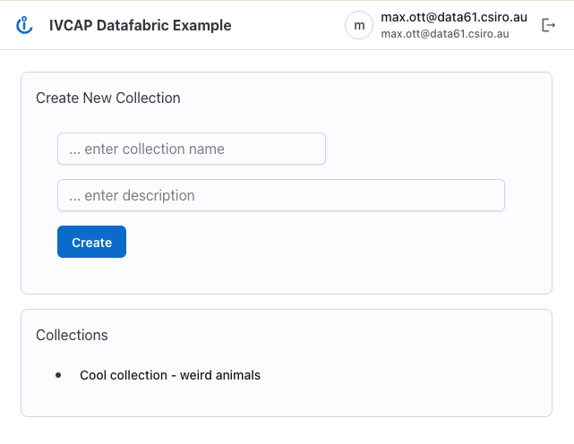
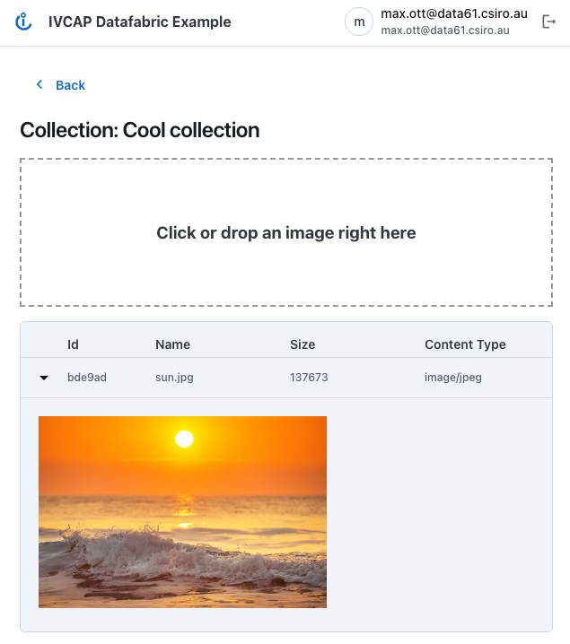

# IVCAP DataFabric Example

This repo implements a simple "Collection Manager" which uses IVCAP's DataFabric as the backend.


It provides the following capabilities:

* [Create new collections and list already defined ones](#collection-list)
* [View the content of a collection and add new elements to it.](#collection)

To build and run this example see the [Build & Run](#build-run)

## Information Model and IVCAP <a name="model"></a>

The supporting data model for that consists of two "aspects", one defining a collection and one
defining an element in that collection. Both of them are defined as types, `CollectionT`
and `CollectionItemT` in [app.types.ts](./src/app.types.ts) respectively. Beside the content of an aspect, we also need to define a schema. For instance the schema for `CollectionT`
is `urn:sd-test:schema.example.collection.2`.

```typescript
export const NS_PREFIX = "urn:sd-test:"

export const COLLECTION_SCHEMA = NS_PREFIX + "schema.example.collection.2"
export type CollectionT = {
  id: string
  name: string
  description: string
}

export const COLLECTION_ITEM_SCHEMA = NS_PREFIX + "schema.example.collection-item.2"
export type CollectionItemT = {
  name: string
  collectionURN: URN
  artifactURN: URN
  size: number
  contentType: string
}
```

## Creating and managing collections <a name="collection-list"></a>



The above page is defined in [collectionList.pihanga.ts](./src/collectionList.pihanga.ts). The top
of the page shows a form (`CoLiCard.CollectionListCreate`), while the bottom part lists the already
defined collections (`CoLiCard.CollectionList`).

Function `refreshCollectionList` implements the code to fetch the list of "known" collections:

```
function refreshCollectionList() {
  ivcapAspect.list(
    {
      schema: COLLECTION_SCHEMA,
      includeContent: true,
    },
    (s, { aspects, nextPage }) => {
      ...
    },
  )
}
```

The `ivcapAspect.list` command queries the datafabric for all records with schema `COLLECTION_SCHEMA` and
visible to the user. The list of aspects found is passed to the callback function provided as second argument
to the list function. If the number of aspects found is larger than some threshold (max. 50), a reference
to the next page is returned in `nextPage` and should be used as an additional parameter to a future query.

The code for creating a new collection can be found in the `onSubmit` function to the `CoLiCard.CollectionListCreate` card.

```
onSubmit: (_, { formData }, d) => {
  const { name, description } = formData
  ivcapAspect.create(
    {
      entity: NS_PREFIX + "collection:" + uuidv4(),
      schema: COLLECTION_SCHEMA,
      content: { name, description },
      contentType: "application/json",
    },
    (_, a) => {
      console.log(">>>", a)
    },
  )
},
```

## Managing and creating items within a collection <a name="collection"></a>



The above page is defined in [collection.pihanga.ts](./src/collection.pihanga.ts)
and has the following sections:

1. Back to collection list button (< Back)
1. The name of the collection
1. [A drop zone for adding new images to the collection](#add-image)
1. [A table describing all the images currently in the collection](#collection-items)
    * [Drawer to show item (artifact) itself](#display-artifact)

### Adding new images (artifacts) <a name="add-image"></a>

The `onFileDropped` function implements the adding of a image (file) as
artifact as well as the `CollectionItemT` aspect tying the artifact to a collection.

```typescript
function onFileDropped(s: AppState, { name }: FileDroppedEvent) {
  const file = get_last_dropped(name)
  if (!file) return

  const collectionURN = s.route.path[1]
  // uploading file as artifact
  ivcapArtifact.create({ file, name }, (_, a) => {
    // create a COLLECTION_ITEM_SCHEMA to tie artifactURN to the collectionURN
    const { artifactURN, size, contentType } = a
    const content = { name, artifactURN, collectionURN, size, contentType }
    ivcapAspect.create(
      {
        entity: NS_PREFIX + "collection-item:" + uuidv4(),
        schema: COLLECTION_ITEM_SCHEMA,
        content,
        contentType: "application/json",
      },
      // update the local state so that the new item appears in the UI list
      (s, { aspectID }) => {
        if (s.collection) {
          s.collection.items.push({
            id: aspectID,
            ...content,
          })
        }
      },
    )
  })
}
```

### Getting the list of items in the collection <a name="collection-items"></a>

The `refreshCollection` function implements the code to fetch the list of items
currently part of the collection and it also fetches information on the collection
itself.

```typescript
function refreshCollection(id: string) {
  // fetch all items in the collection
  ivcapAspect.list(
    {
      schema: COLLECTION_ITEM_SCHEMA,
      filter: `collectionURN~=${id}`,
      includeContent: true,
    },
    (s, { aspects }) => {
      ...
    },
  )
  // refresh info about the collection (e.g. name) itself
  ivcapAspect.list(
    {
      entity: id,
      schema: COLLECTION_SCHEMA,
      includeContent: true,
    },
    (s, { aspects }) => {
      ...
    },
  )
}
```

The first query, beside `schema` also includes a `filter` which is applied to the
content of every aspect with a `COLLECTION_ITEM_SCHEMA` schema. As mentioned above,
the respective schema (`CollectionItemT`) also defines a `collectionURN` element
which indicates the collection this item is part of.

> Note: We could have extended the `COLLECTION_SCHEMA` with an `items` which
holds an array of all the items. In this case adding a new item, or removing an
item would have required us to update (retract-create) the respective collection
aspect. Keeping it separate tends to make extending functionality a lot easier, not
to mention potential race condition issues.

### Display artifact <a name="display-artifact"></a>

When clicking on the ">" icon in the items table, a "drawer" appears which
contains the artifact (image) associated with this item. The relevant code
can be found in:

```typescript
ImageViewer({
  imgURL: (_, { ctxtProps }) => {
    const d = ctxtProps.row.data as CollectionItemStateT
    if (d.data) {
      return d.data
    }

    ivcapArtifact.getData({ id: d.artifactURN }, (s, { data }) => {
      if (s.collection) {
        s.collection.items = s.collection.items.map((c) => {
          if (c.artifactURN === d.artifactURN) {
            return { ...c, data }
          }
          return c
        })
      }
    })
  },
  ...
```

## Build & Run <a name="build-run"></a>

This application uses [vitejs](https://vite.dev) and the
[Pihanga UI](https://github.com/ivcap-works/pihanga2) library
and follows the standard build, run and test convention using
[yarn](https://yarnpkg.com/)

* **Setup:** `yarn install`
* **Play:** `yarn start`
* **Build & package:** `yarn build && yarn preview --port 3000`